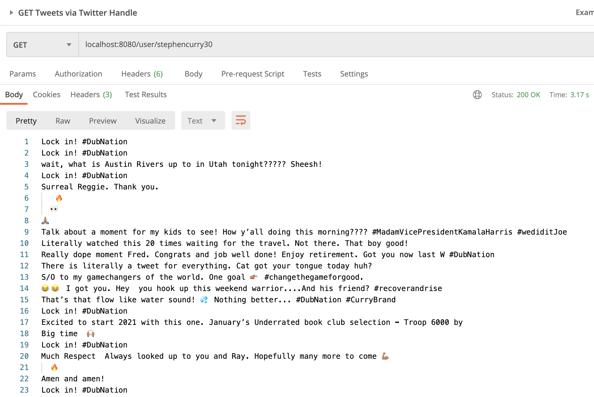
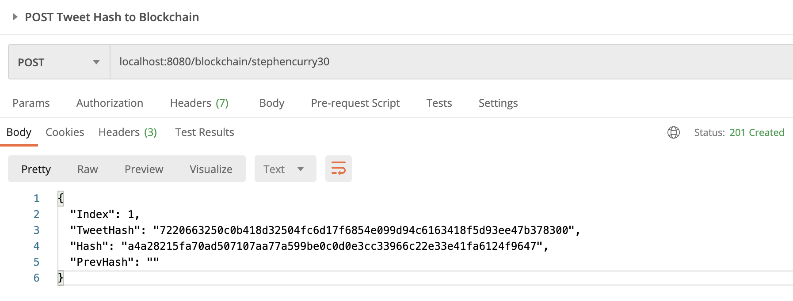
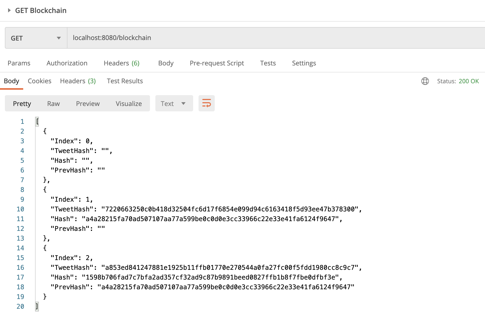

# Twitter Ledger
A blockchain proof of concept that scrapes a user's tweets using the Twitter API and builds a ledger of tweets.
If you wish to try this out, you'll need a Twitter developer account + API keys.
### Overview
Currently, all users are subject to Twitter's central authority. Anyone can delete his or her own tweets, but so can Twitter. All content moderation is done by Twitter, and all tweets live in Twitter's databases.

What would a decentralized Twitter look like? Rather than storing tweets in Twitter's databases, they would be stored on the blockchain. Posting a new tweet would add the record to a shared distributed ledger. If any outsider were to delete or tamper with your tweets (like how Twitter can moderate your content), this ledger would serve as a reference to your tweets.

If you're just as fascinated by this concept as me, you can read more about work being done on this [here](https://matrix.org/_matrix/media/r0/download/twitter.modular.im/981b258141aa0b197804127cd2f7d298757bad20).

How would this ledger work? As a first pass, we could scrape all of a user's tweets, convert it into a long string, and generate a hash via the SHA-256 algorithm. This hash serves as a reference to all of my tweets at a given moment in time (think of it like a tweet archive). If Twitter (or a hacker) deletes even a character in one of my tweets, the hash will be completely different and I'll know someone was tampering with my data. This is a very basic and simple implementation of this concept. I'm no expert on blockchain -- this proof of concent is meant to explore this idea more!

Check out [this blog](https://mycoralhealth.medium.com/code-your-own-blockchain-in-less-than-200-lines-of-go-e296282bcffc) for a tutorial on building the Block class used in my repo.

### Demo
Using the Twitter API we can scrape [`@StephenCurry30`](https://twitter.com/stephencurry30)'s original tweets as shown below. I created this endpoint just to have a visual representation of what is inputted to calculate the tweet hash.

Let's make a `POST` request to the blockchain and pass in Steph's handle. This will retrieve the scraped tweets and input it into a SHA-256 hash algorithm. Then it takes the calculated tweet hash and generates a new block that gets added to the chain.


### Project Directory
* `main.go` configures our handlers and is the app's entry point
* `blockchain.go` constructs a Block class and manages the blockchain
* `tweets.go` scrapes tweets and calculates a hash from the tweets
### Endpoints
| Endpoint | HTTP Method | Description |
| ------ | ------ | ------ |
| `/blockchain` | GET | Returns the blockchain
| `/blockchain/{id}` | POST | Scrapes the tweets of user `id`, calculates the tweet hash, generates a new block and adds it to the blockchain
| `/user/{id}` | GET | Returns the scraped tweets of user `id`
### Setup
If you have a Twitter developer account, you can clone this repo and add a `.env` file to the root directory with the following variables.
```
PORT=8080
APIKEY=
APISECRET=
TOKEN=
TOKENSECRET=
```
Use the `go run *.go` command to start the project. Endpoints will be available at `localhost:8080/` (or whatever port you chose). I recommend using Postman to hit the endpoints, but you can also just use your browser.

### Next Steps
Storing all of a user's tweets is pretty inefficient. People tweet often. Instead, I'd like to build out a system that can connect to the Twitter API and store every new tweet on the blockchain. That way I can have a record of all my tweets. I would hope to be able to retrieve those tweets as well. And eventually, if there is a decentralized standard and protocol for social media that Twitter becomes a client of, a system like this would allow me to port over all my tweets there. (Just as how email works, you can transfer all your emails over to whichever client you wish to use.)
